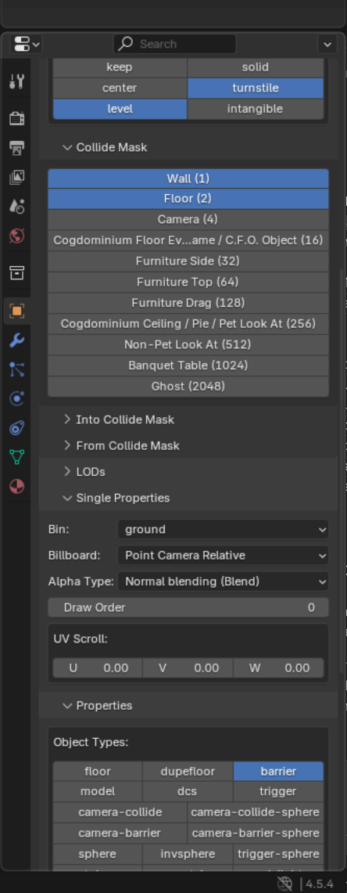

Modernized Alternative (of) Yet Another Blender Egg Exporter (MAYBEE) - with Panda3D Tools
==========================================================================================
*Technically MAYABEE, but I don't want to call it that.*

----------------------------------

MAYBEE is a fork of the Yet Another Blender Egg Exporter (YABEE) plugin. It is a renewed Panda3D Egg file exporter for Blender that supports versions >=2.7+

With dozens of outdated YABEE repositories, it's hard to find which version supports modern versions of Blender. MAYBEE sticks out from the outdated YABEE variants.

# Features
MAYBEE has support for exporting the following:
- Meshes
- UV layers
- Materials 
- Vertex colors
- Textures (Diffuse textures and Normal maps)
- Armature (skeleton) animation
- ShapeKeys (morph) animation
- Non-cyclic NURBS Curves
- LODs

# Limitations
The following are currently not supported/implemented by MAYBEE:
- Texture baking via Cycles
- Non-Shader Mode for Materials & Textures

# Extra features in the `darktohka` fork

There are some extra features in the `darktohka` fork:
- Panda3D Tools GUI that allows lots of egg properties to be set for each node
- Fixed Mix Shader problem that resulted in textures disappearing when connected to a mix shader
- Added new export options for LODs and more

**To be used with the darktohka [blender-egg-importer](https://github.com/darktohka/blender-egg-importer) fork!**